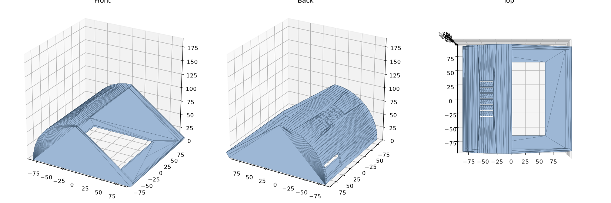

# Enclosure of the kiosk

A 3D-printed desk enclosure for the reference hardware
([docs/hardware.md](../docs/hardware.md)): a Lenovo ThinkCentre Tiny and a
Waveshare 7-inch HDMI LCD (C).

| File | Content |
|---|---|
| `usb-pasteur.stl` | the model to print: one part, about 191 x 184 x 86 mm (binary STL, millimetres) |
| `usb-pasteur.png` | views of the model (front, back, top) |
| `LICENSE` | CERN Open Hardware Licence Version 2 - Strongly Reciprocal |

The front face, tilted, holds the screen in its window; the rounded back has
ventilation slots on its top.

## Licence

Copyright the USB-Pasteur contributors.

This source describes Open Hardware and is licensed under the CERN-OHL-S
v2 (`LICENSE`, https://ohwr.org/cern_ohl_s_v2.txt).

You may redistribute and modify this source and make products using it
under the terms of the CERN-OHL-S v2. This source is distributed WITHOUT ANY
EXPRESS OR IMPLIED WARRANTY, INCLUDING OF MERCHANTABILITY, SATISFACTORY
QUALITY AND FITNESS FOR A PARTICULAR PURPOSE. Please see the CERN-OHL-S v2
for applicable conditions.

Source location: https://github.com/dbarzin/usb-pasteur/tree/main/3D

As per CERN-OHL-S v2 section 4, should you produce hardware based on this
source, you must where practicable maintain the Source Location visible on
the external case of the enclosure or other products you make using this
source.
