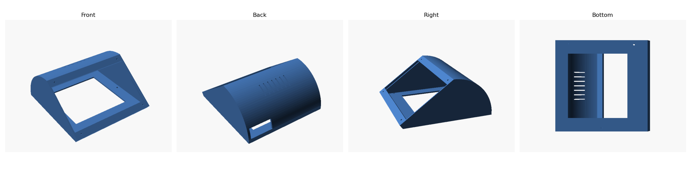
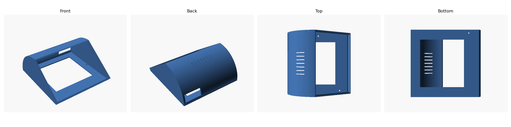

# Enclosure of the kiosk

A 3D-printed desk enclosure for the reference hardware
([docs/hardware.md](../docs/hardware.md)): a Lenovo ThinkCentre Tiny and a
screen, in two versions.

| File | Content |
|---|---|
| `usb-pasteur-7inch.stl` | the model for a 7-inch screen such as the Waveshare 7-inch HDMI LCD (C) |
| `usb-pasteur-7inch.png` | views of the 7-inch model (front, back, right, bottom) |
| `usb-pasteur-10inch.stl` | the model for a 10-inch screen |
| `usb-pasteur-10inch.png` | views of the 10-inch model (front, back, top, bottom) |
| `LICENSE` | CERN Open Hardware Licence Version 2 - Strongly Reciprocal |

Each model is one part, about 191 x 184 x 86 mm (binary STL, millimetres).
The front face, tilted, holds the screen in its window; the rounded back has
ventilation slots on its top.

The 10-inch model has a 180 x 128 mm window. The 7-inch model is sized for
a 165 x 100 mm screen: a 14 mm band at the top and at the bottom of the
window leaves a 100 mm high opening. Each band has two 3 mm holes to screw
the screen from behind, 157.5 mm apart across the face and 115 mm apart
along the slope. Its right wall, seen from the front, is 2 mm thick instead
of 5 mm behind the screen, to leave room for the HDMI and USB cables.

The base of both models has three 3.8 mm holes to screw it on the VESA
mounting bracket of the Lenovo ThinkCentre Tiny (M720), 8.5 mm from the side
edges: two on the left, 27.15 and 157.15 mm from the front edge, and one on
the right, 92.15 mm from the front edge.

## Licence

Copyright the USB-Pasteur contributors.

This source describes Open Hardware and is licensed under the CERN-OHL-S
v2 (`LICENSE`, https://ohwr.org/cern_ohl_s_v2.txt).

You may redistribute and modify this source and make products using it
under the terms of the CERN-OHL-S v2. This source is distributed WITHOUT ANY
EXPRESS OR IMPLIED WARRANTY, INCLUDING OF MERCHANTABILITY, SATISFACTORY
QUALITY AND FITNESS FOR A PARTICULAR PURPOSE. Please see the CERN-OHL-S v2
for applicable conditions.

Source location: https://github.com/dbarzin/usb-pasteur/tree/main/3D

As per CERN-OHL-S v2 section 4, should you produce hardware based on this
source, you must where practicable maintain the Source Location visible on
the external case of the enclosure or other products you make using this
source.
